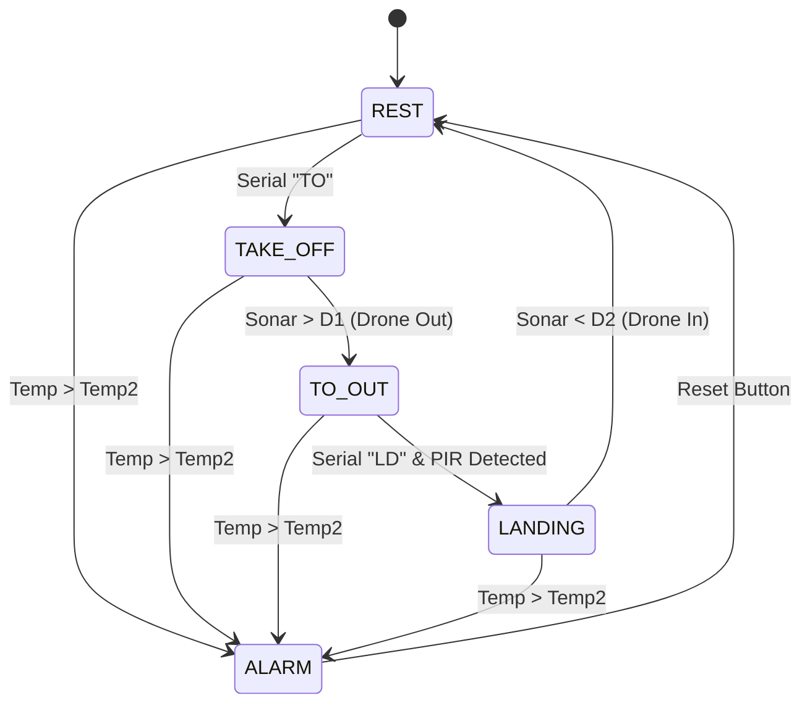

# Smart Drone Hangar - Project Report

## Overview
The Smart Drone Hangar is an embedded system designed to manage a drone hangar. It consists of two subsystems:
1.  **Drone Hangar**: Arduino-based controller managing the door, sensors, and indicators.
2.  **Drone Remote Unit (DRU)**: Java-based PC application for remote control and monitoring.

## Architecture
### Arduino Subsystem
The Arduino code is implemented using a task-based architecture with a cooperative scheduler.
- **Scheduler**: Manages the execution of tasks.
- **SmartHangarTask**: Implements the main Finite State Machine (FSM).
- **BlinkTask**: Handles the blinking of the L2 LED.
- **TempMonitorTask**: Monitors temperature and triggers alarms.

### Finite State Machine (FSM)
The `SmartHangarTask` follows this FSM:

## Serial Protocol
- **PC -> Arduino**:
    - `TO`: Take Off
    - `LD`: Land
- **Arduino -> PC**:
    - `DRONE INSIDE`: State update
    - `TAKE OFF`: State update
    - `DRONE OUT`: State update
    - `LANDING`: State update
    - `ALARM`: Alarm triggered
    - `REST`: System reset

## Components
- **L1 (Green)**: Power/Status
- **L2 (Green)**: Moving indicator (Blinking)
- **L3 (Red)**: Alarm
- **Servo**: Hangar Door
- **Sonar**: Distance measurement
- **PIR**: Presence detection
- **Temp Sensor**: Temperature monitoring
- **LCD**: User interface on the hangar
- **Button**: Reset

## Java Application
The DRU is a Swing-based GUI that allows the operator to send commands and view the system status. It uses a serial library to communicate with the Arduino.
